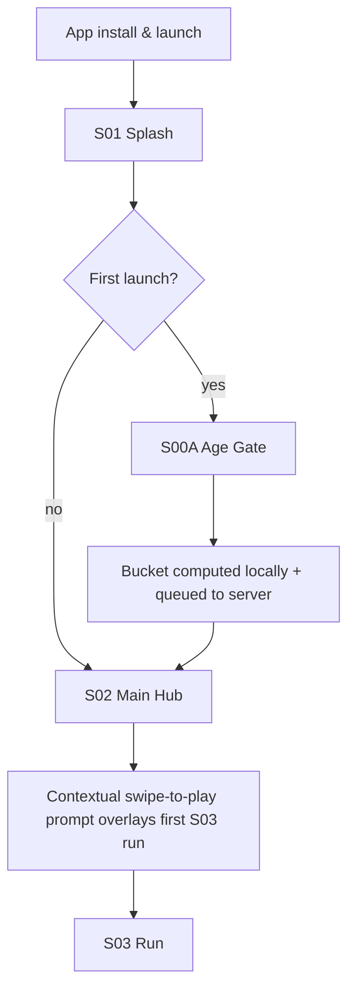
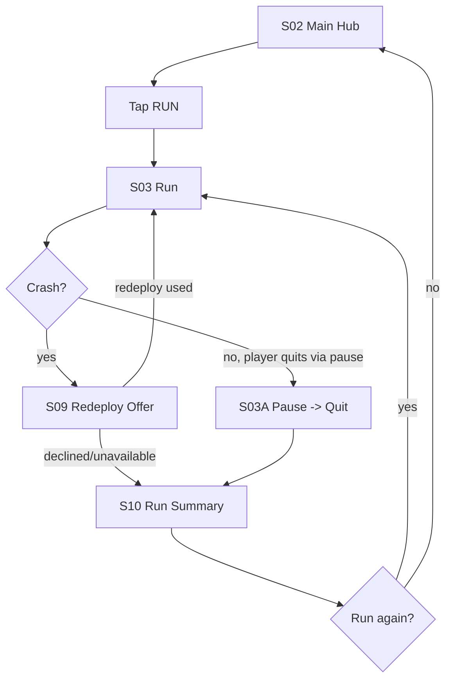
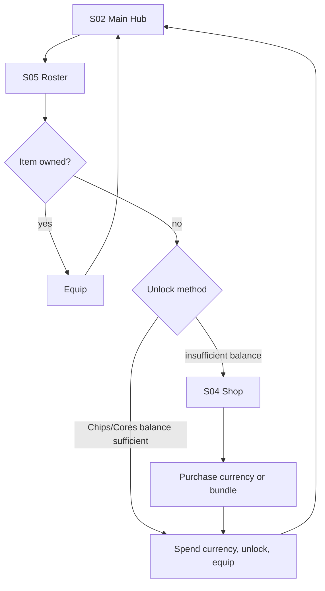
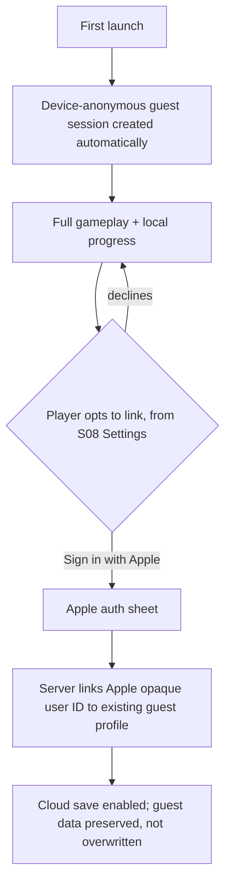
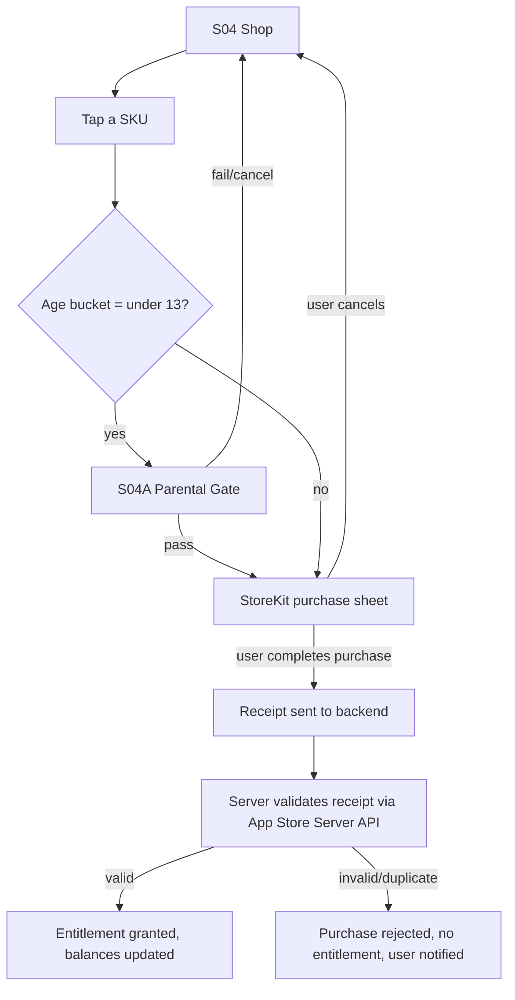
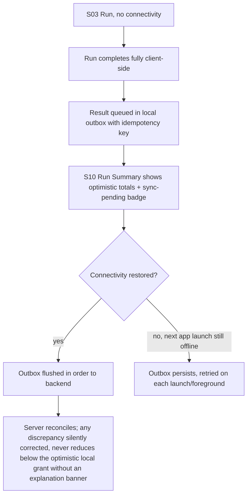
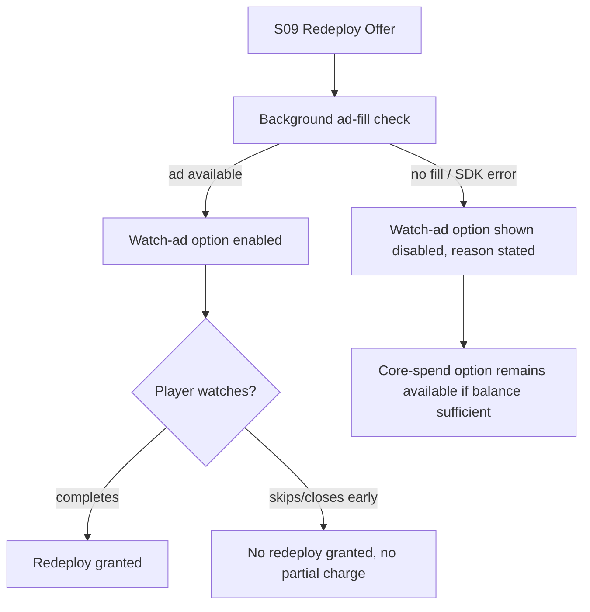
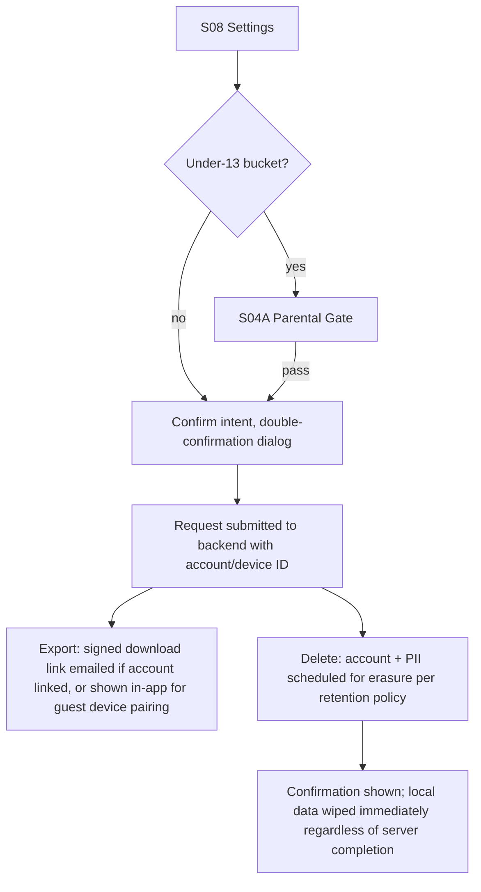
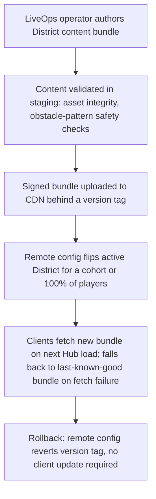

# 03 User Flows — Skyline Rush

All flows are Proposed original UX. Screen IDs reference [[02_UX_SCREEN_SPEC]].

## 1. First run (onboarding)

No modal tutorial blocks play — the first run itself teaches the controls via
low-obstacle-density onboarding content in the starter District (a Proposed
design choice consistent with the reference's documented low-friction
onboarding pattern).

## 2. Primary happy path (a single run)

## 3. Creation/edit-equivalent path: Roster equip & unlock

## 4. Auth: guest to linked account

Failure/recovery: if linking fails mid-flow (network drop, Apple auth
cancel), the guest profile is untouched and no partial link state is
persisted — see [[09_AUTH_AND_PERMISSIONS]].

## 5. Purchase flow (with parental gate)

## 6. Offline play and recovery

Full detail on the outbox mechanism and conflict resolution in
[[10_OFFLINE_SYNC_AND_STORAGE]].

## 7. Error path: ad fill failure during Redeploy

## 8. Data deletion / export

Retention/erasure timelines defined in [[08_SAFETY_PRIVACY_COMPLIANCE]].

## 9. Admin/live-ops: District Rotation publish (operator-facing, P1)

