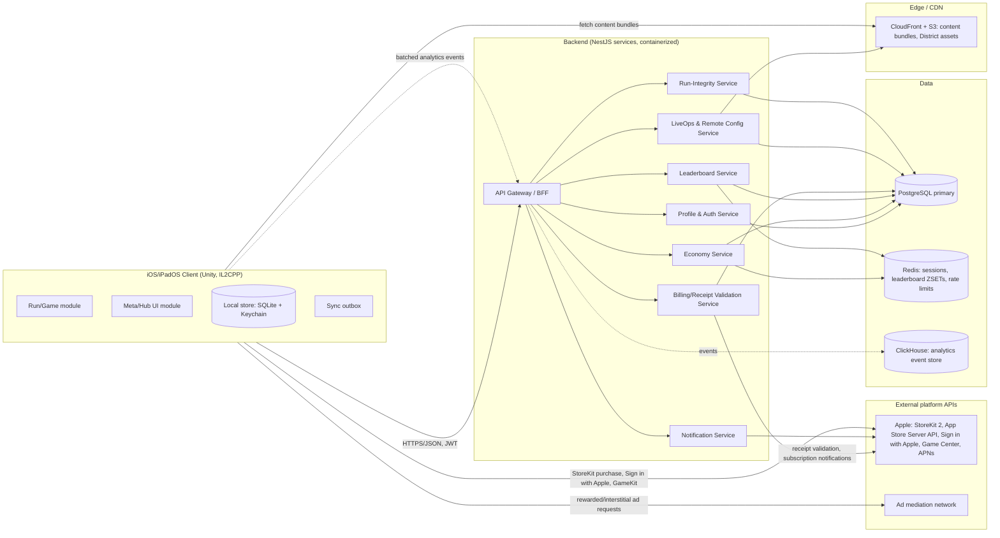

# 04 System Architecture — Skyline Rush

Stack: Unity (C#) client + Node.js/TypeScript (NestJS) backend + PostgreSQL +
Redis + S3/CloudFront. Chosen per [[engineering-guidelines]] game criteria:
rendering (2.5D rooftop scenes, particle-heavy power-ups) and target platform
(iOS/iPadOS first, Android path kept open) favor Unity over a native
SpriteKit build; the backend favors a small set of stateless TypeScript
services over a monolith so live-ops (District Rotation, Season Pass) can
ship without app-binary releases.

## Architecture diagram

## Client modules (Unity)

- **Run/Game module**: procedural District track assembly (see
  [[07_AI_OR_AUTOMATION_PIPELINE]]), physics/collision, input handling,
  power-up state machine. No network dependency during a run.
- **Meta/Hub UI module**: Hub, Shop, Roster, Contracts, Leaderboard,
  Settings — all built as separate addressable UI flows to keep the Run
  module's binary/asset footprint independent of meta content.
- **Local store**: SQLite for structured local state (owned items, cached
  balances, Contract cache) + Keychain for the guest device identity/JWT
  refresh token. Never stores raw payment data (StoreKit handles that
  entirely).
- **Sync outbox**: append-only local queue of pending server calls (run
  results, reward grants) with idempotency keys, flushed on connectivity;
  see [[10_OFFLINE_SYNC_AND_STORAGE]].

## Backend services

- **API Gateway / BFF**: TLS termination, JWT verification, request
  validation, per-endpoint rate limiting, routes to internal services. Only
  externally reachable surface.
- **Profile & Auth Service**: guest device identity issuance, Sign in with
  Apple linking, age-bucket storage and enforcement, session/JWT issuance
  and refresh.
- **Economy Service**: Chips/Cores ledger (append-only transaction log +
  materialized balance), Supply Drop resolution against the published odds
  table, Contract/Heist/Pass progress and reward grants. All grants are
  idempotent by client-supplied request ID.
- **Leaderboard Service**: Redis sorted sets per District for O(log N)
  rank/write; periodic snapshot to PostgreSQL for durability and friends-
  scope queries that Redis alone can't express cheaply.
- **LiveOps & Remote Config Service**: District Rotation scheduling,
  feature flags, staged rollout percentages, content bundle version
  pointers served to clients; owns the CDN publish pipeline.
- **Billing/Receipt Validation Service**: verifies StoreKit receipts via the
  App Store Server API, consumes App Store Server Notifications V2
  (webhooks) for refunds/revocations, is the sole writer of purchase-backed
  entitlements into the Economy Service (via internal call, not client-
  trusted).
- **Notification Service**: APNs push for re-engagement, respects the
  player's notification preferences and age-bucket ad/marketing
  restrictions.
- **Run-Integrity Service**: server-side plausibility checks on submitted
  run results (max meters/sec, max Chips/meter) to reject implausible
  client-tampered scores from leaderboards without silently banning —
  flagged runs are excluded from leaderboards, not deleted, pending review.

## Synchronous vs. async flows

- Synchronous: auth, purchase-sheet-triggered receipt validation, run-result
  submission (client waits for an ack to clear the outbox entry, but the
  run itself already completed locally before this call).
- Async (queued jobs, BullMQ + Redis): leaderboard snapshot rollups, Season
  rollover reward settlement, push notification batches, App Store Server
  Notification processing, content-bundle CDN invalidation.

## Storage ownership

- PostgreSQL is the system of record for Profile, Economy ledger, Purchases,
  Contracts/Pass definitions and progress, District/content metadata.
- Redis owns ephemeral/high-write state: live leaderboard ranks, session
  cache, rate-limit counters — never the sole copy of anything durable.
- S3/CloudFront owns immutable, versioned content bundles (District assets,
  audio, localized strings) and player-agnostic Supply Drop odds tables
  (versioned so a historical drop can be audited against the table active
  at the time).
- ClickHouse owns append-only analytics events, decoupled from operational
  PostgreSQL so analytics load never contends with gameplay-critical
  queries.

## Caching

- CDN edge caching for all content bundles (long TTL, cache-busted by
  version tag, not by URL mutation).
- Redis caches hot Profile/Economy reads (current balances) with write-
  through on every ledger mutation; cache is never the durability boundary.

## Migrations

- PostgreSQL migrations managed via a versioned migration tool (e.g.
  Prisma Migrate or node-pg-migrate) run in CI before deploy; every
  migration is additive-first (expand/contract pattern) to allow zero-
  downtime rolling deploys — see [[05_DATA_MODEL]] for migration notes per
  entity.

## API versioning, idempotency, pagination, rate limits

Detailed in [[06_API_SPEC]]. Summary: URL-path versioning (`/v1/...`),
client-generated idempotency keys required on every mutating economy/
purchase endpoint, cursor-based pagination on leaderboard and history
endpoints, per-account and per-IP rate limits enforced at the Gateway.

## Failure/retry behavior

- Client → Gateway calls use exponential backoff with jitter, capped
  retries, and never retry a non-idempotent call without its original
  idempotency key.
- Backend → Apple (receipt validation) retries on 5xx/timeout with backoff;
  a receipt is never discarded on failure — it's parked in a retry queue
  and alerted on if unresolved past a threshold (see
  [[12_ANALYTICS_AND_OBSERVABILITY]]).
- Circuit breakers around the ad-mediation network and Apple APIs so an
  outage there degrades gracefully (ads unavailable, purchases queued)
  rather than blocking core gameplay.

## Scalability

- All backend services are stateless and horizontally scalable behind the
  Gateway; session/JWT design avoids sticky sessions.
- Leaderboard writes are batched per-second per District shard under load
  to bound Redis write amplification during event-start traffic spikes.
- Content delivery is fully offloaded to CDN, so District Rotation launch
  traffic does not load the application backend.

## Environments

- `dev` (per-engineer/local via Docker Compose), `staging` (mirrors prod
  topology, used for App Store review builds and LiveOps content
  validation), `prod`. Sandbox StoreKit/App Store Server API used in
  dev/staging exclusively.

## Deployment / CI/CD

- Backend: containerized services deployed via a managed container
  platform (e.g. ECS/Fargate or equivalent); CI runs lint, unit/integration
  tests, migration dry-run, then builds and pushes images; deploys are
  blue/green with automated rollback on health-check failure.
- Client: Fastlane-driven CI pipeline builds, runs client test suite,
  submits to TestFlight for internal QA, then App Store Connect for review.
- Content bundles: a separate, lighter-weight pipeline (validate → stage →
  publish to CDN → flip remote config) decoupled from app binary releases.

## Observability

Covered fully in [[12_ANALYTICS_AND_OBSERVABILITY]]: structured logs,
distributed tracing across Gateway → services, dashboards for economy
health, purchase funnel, crash-free rate, and alerting thresholds.

## Secrets

Managed via a cloud secrets manager (not environment files in source
control); StoreKit shared secret, APNs keys, and DB credentials rotated on
a defined schedule and injected at deploy time only.

## Backup/recovery

- PostgreSQL: automated daily snapshots + point-in-time recovery (WAL
  archiving), tested restore drills quarterly.
- Redis: treated as rebuildable cache/derived state (leaderboard can be
  rebuilt from PostgreSQL snapshots); not itself backed up as a durability
  source.
- Content bundles: versioned and retained in S3 with lifecycle rules; any
  published version can be re-pointed-to for rollback.
