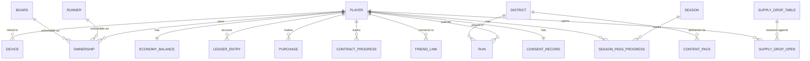

# 05 Data Model — Skyline Rush

All entities are Proposed for this original product. PostgreSQL is system of
record unless noted; see [[04_SYSTEM_ARCHITECTURE]] for storage ownership.

## Entity-relationship overview



## Core entities

### Player
- `player_id` (uuid, PK)
- `guest_device_id` (uuid, nullable, unique) — set for anonymous guests
- `apple_user_id` (text, nullable, unique) — Sign in with Apple opaque ID
- `display_name` (text, nullable, server-generated default e.g. "Runner#4821")
- `age_bucket` (enum: `under_13`, `13_15`, `16_plus`) — required, immutable
  by the client without passing the parental gate flow
- `created_at`, `last_seen_at` (timestamptz)
- **Ownership**: player-owned. **Retention**: see [[08_SAFETY_PRIVACY_COMPLIANCE]].
- Index: unique on `guest_device_id`, unique on `apple_user_id`.

### Device
- `device_id` (uuid, PK), `player_id` (FK), `platform` (enum), `push_token`
  (text, nullable), `app_version`, `last_seen_at`.
- Index: `(player_id)`.

### EconomyBalance (materialized)
- `player_id` (PK, FK), `chips` (bigint, ≥0 constraint), `cores` (bigint,
  ≥0 constraint), `updated_at`.
- Derived from `LedgerEntry`; never mutated directly by client-trusted input.

### LedgerEntry (append-only)
- `entry_id` (uuid, PK), `player_id` (FK), `currency` (enum: chips, cores),
  `delta` (bigint, signed), `reason` (enum: run_pickup, contract_reward,
  supply_drop, purchase, redeploy_spend, refund_reversal, admin_adjustment),
  `idempotency_key` (text, unique per player), `created_at`.
- Index: `(player_id, created_at)`, unique `(player_id, idempotency_key)`.
- **Retention**: kept indefinitely for financial audit (see compliance doc);
  not itself PII beyond the player_id linkage.

### Runner / Board (catalog, near-static content)
- `runner_id` / `board_id` (text slug, PK), `name`, `perk_description`,
  `unlock_cost_cores` (nullable), `unlock_condition` (nullable, e.g.
  "Season 2 Pass tier 10"), `is_starter` (boolean).
- Content-managed via LiveOps pipeline, not per-player rows.

### Ownership
- `player_id` (FK), `item_type` (enum: runner, board, cosmetic_trail),
  `item_id` (text), `equipped` (boolean), `acquired_at`, `acquired_via`
  (enum: starter, currency, supply_drop, pass_reward, purchase).
- PK: `(player_id, item_type, item_id)`.

### Run
- `run_id` (uuid, PK), `player_id` (FK), `district_id` (FK), `runner_id`,
  `board_id`, `meters` (int), `chips_collected` (int), `crashed_cause`
  (enum, nullable), `client_submitted_at`, `server_received_at`,
  `integrity_flag` (enum: ok, suspect, excluded — set by Run-Integrity
  Service), `idempotency_key` (unique per player).
- Index: `(district_id, meters desc)` for leaderboard rebuilds, `(player_id,
  server_received_at)`.
- **Retention**: raw runs older than 180 days rolled up into aggregate
  player-best/district-best stats and purged of row-level detail; see
  [[08_SAFETY_PRIVACY_COMPLIANCE]].

### District
- `district_id` (text slug, PK), `name`, `theme_description`,
  `active_content_pack_version`, `status` (enum: draft, live, retired),
  `rotation_starts_at`, `rotation_ends_at` (nullable for the evergreen
  starter District).

### ContentPack
- `content_pack_id` (uuid, PK), `district_id` (FK), `version` (semver),
  `cdn_url`, `checksum`, `published_at`, `status` (enum: staged, live,
  rolled_back).
- Immutable once published; rollback creates a pointer change, not a row
  mutation.

### Contract / ContractProgress
- `contract_id` (text, PK — content-defined, e.g. `daily_2026_08_31_a`),
  `type` (enum: daily, weekly_heist), `objective` (structured JSON:
  {metric, target}), `reward` (structured JSON), `active_from`, `active_to`.
- `ContractProgress`: `(player_id, contract_id)` PK, `progress` (int),
  `completed_at` (nullable).

### Season / SeasonPassProgress (P1)
- `Season`: `season_id` (PK), `district_id` (FK), `starts_at`, `ends_at`,
  `free_track` / `premium_track` (JSON reward tables per tier).
- `SeasonPassProgress`: `(player_id, season_id)` PK, `pass_xp` (int),
  `premium_unlocked` (boolean), `claimed_tiers` (int array).

### SupplyDropTable / SupplyDropOpen
- `SupplyDropTable`: `table_id` (PK), `version`, `entries` (JSON: reward,
  probability — probabilities sum to 1.0, validated at publish time),
  `published_at`.
- `SupplyDropOpen`: `open_id` (uuid, PK), `player_id` (FK), `table_id` +
  `table_version` (FK, pinned at open time for auditability), `result`
  (JSON), `acquired_via` (enum: earned, purchased), `opened_at`.

### Purchase
- `purchase_id` (uuid, PK), `player_id` (FK), `sku`, `platform_transaction_id`
  (unique — Apple original transaction ID), `status` (enum: pending,
  validated, granted, refunded, revoked), `raw_receipt_ref` (pointer to
  encrypted receipt blob, not inline), `created_at`, `validated_at`.
- Index: unique `(platform_transaction_id)` — hard idempotency boundary
  against double-granting the same Apple transaction.

### ConsentRecord
- `player_id` (PK, FK), `age_bucket` (denormalized snapshot at consent
  time), `ad_personalization_allowed` (boolean, false for under_13 and
  under_16 per policy), `analytics_allowed` (boolean), `policy_version`,
  `recorded_at`.
- **Ownership**: player-owned, exportable/deletable on request.

### FriendLink
- `player_id`, `friend_player_id` (composite PK), `source` (enum:
  game_center, friend_code), `created_at`.
- Never derived from device contacts (see [[08_SAFETY_PRIVACY_COMPLIANCE]]).

## Local (client-only) vs. server storage

Stored only on-device (SQLite/Keychain), never sent to the server as raw
values: exact birth year entered at the age gate (only the derived
`age_bucket` is transmitted), locally-buffered analytics events pending
batch upload, the sync outbox itself.

Server-authoritative and never client-trusted for grant purposes: economy
balances, ownership, purchase entitlements, leaderboard rank. The client may
show optimistic local state (see [[10_OFFLINE_SYNC_AND_STORAGE]]) but the
server reconciles it.

## Indexes summary

Primary indexes are listed per entity above. Additional composite indexes:
`Run(district_id, integrity_flag, meters desc)` for fast leaderboard
rebuilds excluding flagged runs; `LedgerEntry(player_id, currency,
created_at)` for balance-history queries in the export flow.

## Migrations

Expand/contract pattern: new nullable columns ship before code depends on
them; enum values are only appended, never removed, within a release cycle;
`SupplyDropTable` and `Season`/`Contract` content rows are immutable once
published (a correction publishes a new version rather than mutating history)
so that a past `SupplyDropOpen.table_version` reference always resolves to
the exact odds shown to the player at open time.

## SQL sketch (core tables)

```sql
create table player (
  player_id uuid primary key default gen_random_uuid(),
  guest_device_id uuid unique,
  apple_user_id text unique,
  display_name text,
  age_bucket text not null check (age_bucket in ('under_13','13_15','16_plus')),
  created_at timestamptz not null default now(),
  last_seen_at timestamptz not null default now()
);

create table economy_balance (
  player_id uuid primary key references player(player_id),
  chips bigint not null default 0 check (chips >= 0),
  cores bigint not null default 0 check (cores >= 0),
  updated_at timestamptz not null default now()
);

create table ledger_entry (
  entry_id uuid primary key default gen_random_uuid(),
  player_id uuid not null references player(player_id),
  currency text not null check (currency in ('chips','cores')),
  delta bigint not null,
  reason text not null,
  idempotency_key text not null,
  created_at timestamptz not null default now(),
  unique (player_id, idempotency_key)
);
create index on ledger_entry (player_id, created_at);

create table run (
  run_id uuid primary key default gen_random_uuid(),
  player_id uuid not null references player(player_id),
  district_id text not null,
  runner_id text not null,
  board_id text not null,
  meters integer not null check (meters >= 0),
  chips_collected integer not null check (chips_collected >= 0),
  crashed_cause text,
  client_submitted_at timestamptz not null,
  server_received_at timestamptz not null default now(),
  integrity_flag text not null default 'ok',
  idempotency_key text not null,
  unique (player_id, idempotency_key)
);
create index on run (district_id, integrity_flag, meters desc);

create table purchase (
  purchase_id uuid primary key default gen_random_uuid(),
  player_id uuid not null references player(player_id),
  sku text not null,
  platform_transaction_id text not null unique,
  status text not null default 'pending',
  raw_receipt_ref text,
  created_at timestamptz not null default now(),
  validated_at timestamptz
);
```
